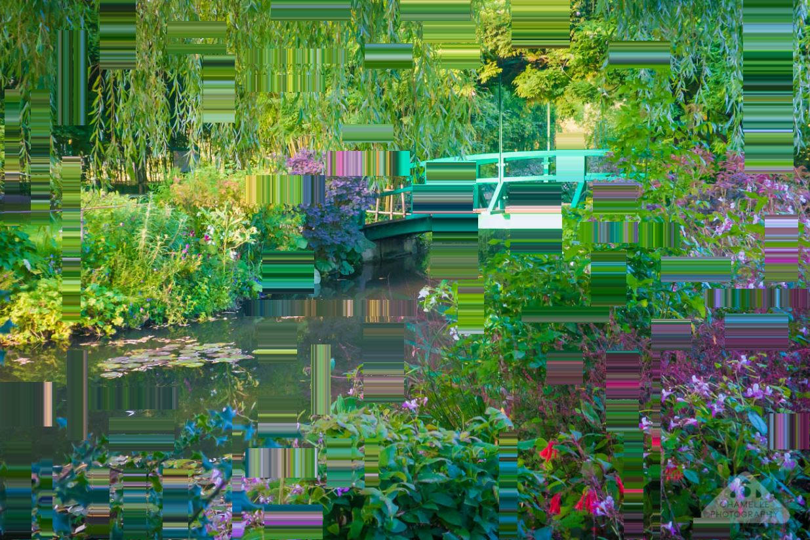
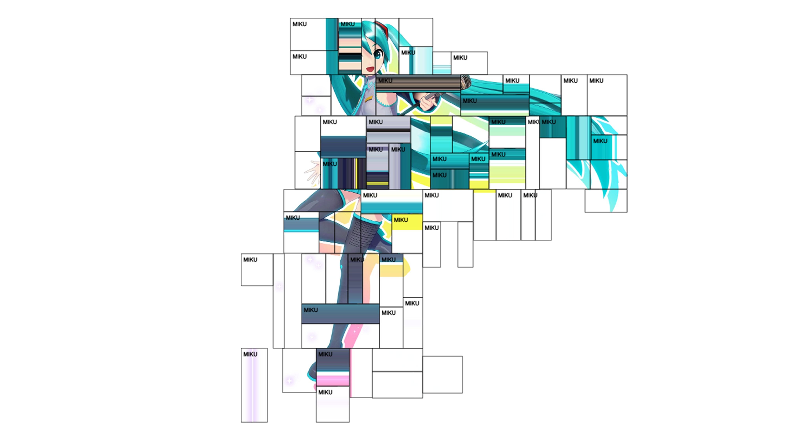
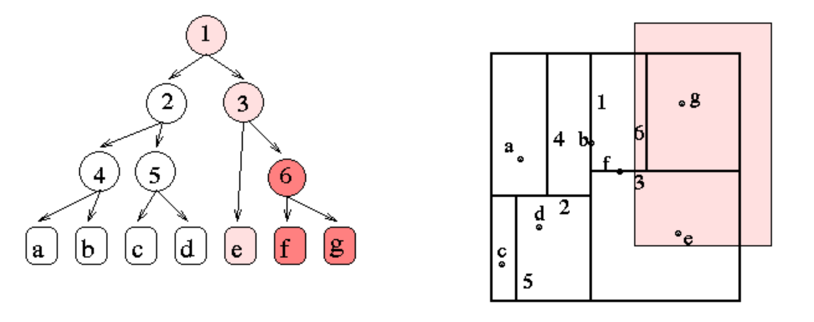

import { Image } from 'astro:assets';
import thefinals from '../../../assets/blog/code/mimage/thefinals.png';

connect at <a href="/apps/mimage" target="_blank" class="">sanalog.net/apps/mimage</a>.
{/* <!-- this is a unique link where it's not external but still target _blank --> */}

# mimage+

## Grid and Stretch Tool

connect at <a href="/apps/stretchgrid" target="_blank" class="">sanalog.net/apps/stretchgrid</a>.

There is not much to this tool. It modifies images with arbitrary pixel stretches in a randomised grid. There are fewer than ten parameters and every option provides a live preview, so I will not explain each function or make a guide. But I have included some insight behind the code so one can modify it for their needs.

Use a normal picture and the output will look something like this.


<p class="small muted c">look what we need to mimic a fraction of his power</p>

Other than grid drawing and stretching, you can add labels (in comma-separated format) and change their frequency. The label placements are randomised and does not perform any semantic object detection or classification. It nearly mimics the effect to a poor degree. Convenient libraries do exist that would make this feature trivial to implement, but it was in the interest of speed and scope creep that such a feature was forgone.

There is a little more. The tool comes with rudimentary contour detection. Unfortunately there's no toggle switch, so it will automatically draw grids around the subject given an image with a transparent background. This is its intended purpose--to be used with single-subject transparent images.


<p class="small muted c">credit: Hatsune Miku: Project Diva Mega Mix+</p>

It is an interesting aesthetic. However, potential is realised when the tool is used in conjunction with other tools, mixed with different effects.

<div class="wide">
<Image src={thefinals} alt="" />
<p class="small muted c">credit: embark-studios.com/press</p>
</div>

### The code

Source on <a href="https://github.com/itsSanalog/sanalog.net/blob/main/sanastro/src/scripts/apps/mimagePlus/stretchgrid.js" target="_blank" class="extlink">GitHub</a>.

None of the code is technically impressive, but the one interesting implementation is that of the 'random' grid. A regular or otherwise equispaced grid would be super boring.

My intial approach was to overlay a finely split grid and cluster them using some algorithm. I then realised that a finely split grid on an image were also known as pixels. Anyway, constructing clusters that would add up to the dimensions of the input image sounded painful. While a solution wouldn't be computationally expensive in practice, it did remind me that the <a href="https://en.wikipedia.org/wiki/Subset_sum_problem" target="_blank" class="extlink">subset sum problem is NP-hard</a>.

An approach through division was going to be exponentially simpler to implement. With the idea of algorithms already in my head, the visualisation of a k-d tree was a good approximation of what I wanted to achieve.


<p class="small muted c">groups.csail.mit.edu/graphics/classes/6.838/S98/meetings/m13/kd.html</p>

The practical implementation is boring.

```js
// 2. perform subdivision KD-Tree
let rects = [];

// only start subdividing if the whole image isn't purely empty
if (!isRectEmpty(0, 0, 1, 1, w, h, imgData)) {
  rects.push({ x: 0, y: 0, w: 1, h: 1 });
}

const numSplits = parseInt(elements.complexity.value);

for (let i = 0; i < numSplits; i++) {
  if (rects.length === 0) break;

  // weight probability towards larger rectangles
  let rIndex = 0;
  let maxArea = 0;
  for (let j = 0; j < rects.length; j++) {
    const area = rects[j].w * rects[j].h;
    if (area * Math.random() > maxArea) {
      maxArea = area * Math.random();
      rIndex = j;
    }
  }

  const toSplit = rects.splice(rIndex, 1)[0];
  
  let splitH = toSplit.w > toSplit.h;
  if (Math.random() < 0.25) splitH = !splitH; 
  
  const splitRatio = 0.3 + (Math.random() * 0.4);

  let r1, r2;
  if (splitH) {
    const w1 = toSplit.w * splitRatio;
    r1 = { x: toSplit.x, y: toSplit.y, w: w1, h: toSplit.h };
    r2 = { x: toSplit.x + w1, y: toSplit.y, w: toSplit.w - w1, h: toSplit.h };
  } else {
    const h1 = toSplit.h * splitRatio;
    r1 = { x: toSplit.x, y: toSplit.y, w: toSplit.w, h: h1 };
    r2 = { x: toSplit.x, y: toSplit.y + h1, w: toSplit.w, h: toSplit.h - h1 };
  }

  // ONLY push the new rectangles if they contain part of the subject
  if (!isRectEmpty(r1.x, r1.y, r1.w, r1.h, w, h, imgData)) rects.push(r1);
  if (!isRectEmpty(r2.x, r2.y, r2.w, r2.h, w, h, imgData)) rects.push(r2);
}
```

Below is the code for finding the image contours. It can be disabled or modified easily, depending on the desired effect. Just return false on everything or tweak the RGBA values.

```js
// check if a specific normalized rectangle is purely transparent
function isRectEmpty(rectX, rectY, rectW, rectH, imgW, imgH, pixelData) {
  const px = Math.floor(rectX * imgW);
  const py = Math.floor(rectY * imgH);
  const pw = Math.max(1, Math.floor(rectW * imgW));
  const ph = Math.max(1, Math.floor(rectH * imgH));
  
  const startX = Math.max(0, px);
  const startY = Math.max(0, py);
  const endX = Math.min(imgW, px + pw);
  const endY = Math.min(imgH, py + ph);
  
  for (let y = startY; y < endY; y++) {
    for (let x = startX; x < endX; x++) {
      // alpha channel is index 3 in RGBA
      const alpha = pixelData[(y * imgW + x) * 4 + 3];
      if (alpha > 10) return false;
    }
  }
  return true; // fully transparent
}
```

Text and border effects are also quite flexible. The lines that are commented out, for example, will add a background behind each annnotation label.

```js
if (elements.wireframe.checked) {
  ctx.strokeStyle = '#000000'; 
  ctx.lineWidth = 0.8;
  ctx.strokeRect(ix, iy, iw, ih);
}

if (elements.showText.checked && cellData.text) {
  ctx.fillStyle = '#000';
  ctx.font = 'bold 10px Helvetica, sans-serif';
  
  // const textMetrics = ctx.measureText(cellData.text);
  // ctx.fillStyle = 'rgba(255, 255, 255, 1)';
  // ctx.fillRect(ix + 2, iy + 2, textMetrics.width + 4, 16);

  ctx.fillStyle = '#000';
  ctx.fillText(cellData.text, ix + 4, iy + 14);
}
```

If anyone makes a better version, I'd be more than happy to use that instead. This is not an invitation, it is a plea.