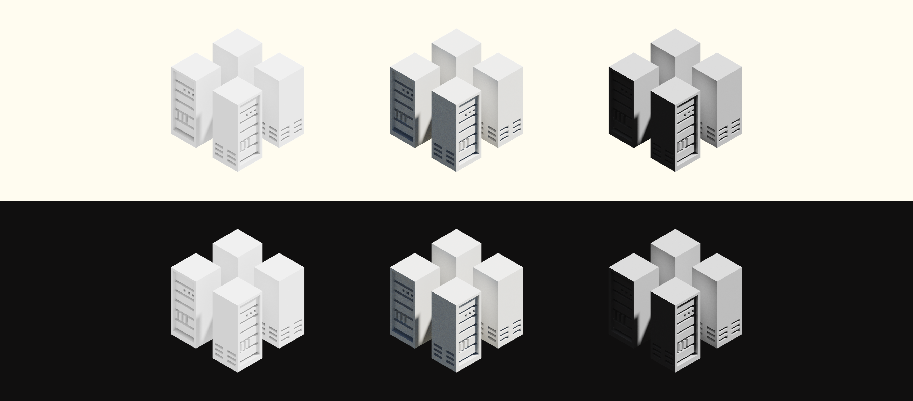
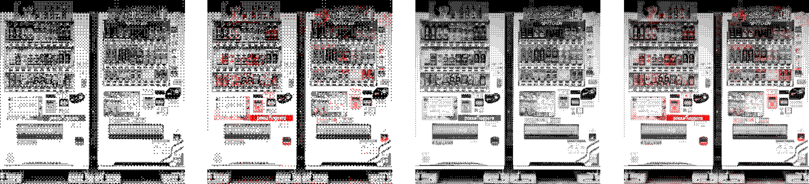

A collection of the dumbest, littlest things. In no particular order.

<br>

1. ### last updated

Should `last updated` be at the head of your content, or at the end? To those who revisit the page regularly for updates, the former would obviously be helpful, but it draws precious attention away from the title or header image.

Should it be sentence case, lowercase, or title case?

**verdict:** <a href="#lastupdate">at the feet</a>, in lowercase.

2. ### quick links

Should an interpunct (U+00B7) or a vertical bar (U+007C) be used as separators for these [quick links](/blog/reviews)?

<div class="flex justify-center mmb">
  <a class="plain mmr">music</a>&centerdot;
  <a class="plain mml mmr">games</a>&centerdot;
  <a class="plain mml mmr">film</a>&centerdot;
  <a class="plain mml mmr">webtoon</a>&centerdot;
  <a class="plain mml">tools</a>
</div>
<div class="flex justify-center">
  <a class="plain mmr">music</a>&VerticalLine;
  <a class="plain mml mmr">games</a>&VerticalLine;
  <a class="plain mml mmr">film</a>&VerticalLine;
  <a class="plain mml mmr">webtoon</a>&VerticalLine;
  <a class="plain mml">tools</a>
</div>

In code, should `&centerdot;` be used for clarity or is the conciseness of `&xB7;` more favourable?

**verdict:** `&centerdot;`.

3. ### ascending

*Why don't you provide ascending or descending sort options?* (aka: should i?)

I don't have that many entries to warrant them.

Side note: Is `Name (A-Z)` better than `Name (ascending)`? Perhaps `Name (alphabetical, ascending)`? What about `Number (High to Low)` compared to `Number: Descending`? Check this out: <a href="http://contemporary-home-computing.org/turing-complete-user/" target="_blank" class="extlink">contemporary-home-computing.org/turing-complete-user</a> and decide for yourself.

4. ### abbreviations

|||
|:-----|:---|
| CPU  | Processor
| Mobo | Motherboard
| RAM  | Memory
| SSD  | Storage
| GPU  | Video Card
| PSU  | Power Supply
| Case | Case

**verdict:** abbreviated.

5. ### slice

```js
return reviewEntries.map((entry) => ({
  // Removes "[directory]/" prefix from the slug. slice() isn't used for clarity
  params: { slug: entry.slug.replace(/^(music\/)/,"") },
  props: { entry },
}));
```

Regex sucks to use and `slice()` should be more performant, yet I went with regex in this case. Ask yourself if you agree with me.

6. ### file structure
```
📂parent                            📂parent
 ├─📂foo                             ├─📂foo
 │  ├─📜index.html                   │  └─📜(stuff)
 │  └─📜(stuff)                      ├─📜foo.html
 ├─📂bar                  or         ├─📂bar
 │  ├─📜index.html                   │  └─📜(stuff)
 │  └─📜(stuff)                      ├─📜bar.html
 └─📂qux                             └─📂qux
```
The former makes intuitive sense at first glance but looking at multiple `index` files in your editor can be annoying. Pick your poison.

7. ### music table

<table id="reviewsContainer">
  <tr>
    <td class="column-image">
      
    </td>
    <td>
        <a class="plain">Nebulous You</a>
        <br />
        <span class="muted">Della Zyr &centerdot; 2022</span>
    </td>
    <td><span class="muted">2020. 2. 12.</span></td>
    <td>78</td>
  </tr>
    <tr>
    <td class="column-image">
      
    </td>
    <td>
        <a class="plain">Nebulous You</a>
        <br />
        <span class="small">Della Zyr &centerdot; 2022</span>
    </td>
    <td><span class="muted">2020. 2. 12.</span></td>
    <td>78</td>
  </tr>
    <tr>
    <td class="column-image">
      
    </td>
    <td>
        <a class="plain">Nebulous You</a>
        <br />
        <span class="small">Della Zyr &centerdot; </span><span class="small muted">2022</span>
    </td>
    <td><span class="muted">2020. 2. 12.</span></td>
    <td>78</td>
  </tr>
</table>

<style>
  .column-image {
    width: 4em;
  }

  .column-image img {
    border-radius: 0;
    /* transition: border-width 50ms; */
  }

  .column-image img:hover {
    border-style: solid;
    border: 1px solid transparent;
  }
</style>

**verdict:** muted (first option).

8. ### external links

<a class="extlink">External link indicator before punctuation</a>. Next sentence.

<a class="extlink">External link indicator after punctuation.</a> Next sentence.

**verdict:** <a class="extlink plain">before</a>.

9. ### mie density



**verdict:** full lighting (first option).

10. ### intro

It was difficult choosing between these three:

1. Welcome to <a href="https://joelhooks.com/digital-garden" target="_blank" class="extlink">my blog that is not</a>.

2. This is <a href="https://joelhooks.com/digital-garden" target="_blank" class="extlink">my blog that is not</a>.

3. sanaBlog is <a href="https://joelhooks.com/digital-garden" target="_blank" class="extlink">a blog that is not</a>.

While the differences look (and arguably, are) insignificant, I still struggled over this as it was one of the first thing a newcomer would read on my site, as well as it being a defining headline that ultimately dictates if they are welcome or not.

**verdict:** 3, though I might opt for it to be random.

11. ### vending machines

<div class="wide">

  
</div>
<p class="small muted c">left to right: 250px B&W, 250px B/W/R, 400px B&W, 400px B/W/R</p>

**verdict:** 250px B&W.

12. ### capital letters

rUle oF ThUMb for capitalisation:
1. Sentences should be in sentence case. If a period is warranted, so is an initial capital.

2. Buttons, links, and UI elements need not be capitalised, especially if they are `<muted>` or `<faint>`. Exceptions to this are common UI elements such as `Sort by:`, which should follow conventions for user familiarity.

3. Page titles are free game. Stylised however I want.

4. Unique headings should be capitalised. Headings for a list (like this one) need not be.

5. **any of the above should be ignored and broken if deemed fit.**

<br>

<span id="lastupdate" class="muted">last updated on Jun 26, 2024</span>