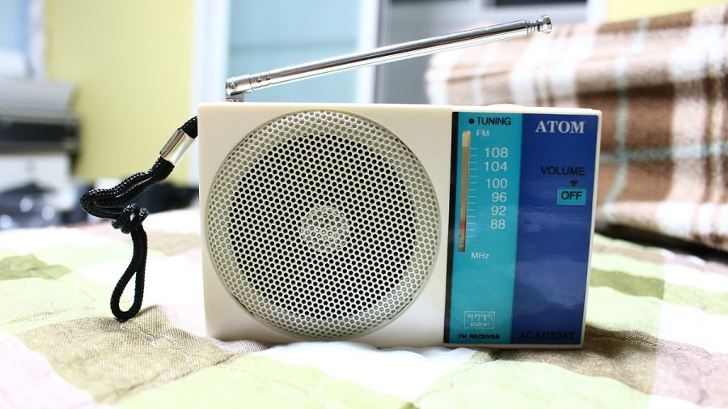
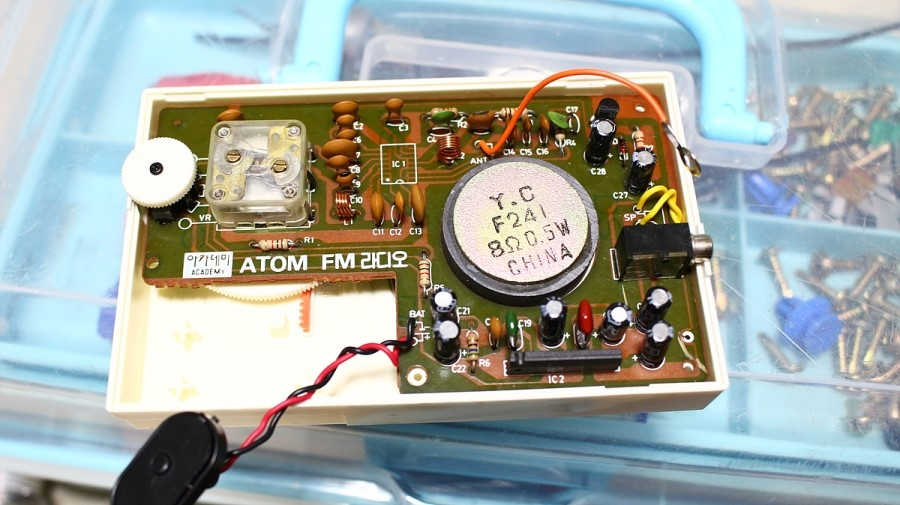

Say you have to make a pocket radio. You have to include a circuit board, a speaker, and two AA batteries.

(class: theme-aware, style: margin: auto;)

a circuit board, a speaker, and two AA batteries

You might go with an arrangement like this:

(class: theme-aware, style: margin: auto;)

look at that mighty ergonomic handle

Designing *as little as possible*, we can save some space by removing those ugly, unnecessary cavities:

(class: theme-aware, style: margin: auto;)

But following good design principles, you will probably end up with this: 

(class: theme-aware, style: margin: auto;)

Indeed, this is what every sensible designer would do.

blog.naver.com/samurai1696/220379264970

To many readers, the 'optimal' arrangement would have been immediately obvious. For product designers, this fundamental exercise is trivial and second nature. However, I wanted to investigate what goes on in our minds that makes us collectively arrive at the same answer. I assume your thought process is something very similar to mine:

> Since the product is a pocket radio, portability is the top priority for arranging the components. The largest parts are the PCB and the speaker, but AA batteries are thick. I'll thus overlap the speaker on the circuit board. The PCB could be L-shaped to accomodate the batteries. This way, not only have we minimised unused space inside the casing, but also the minimum bounding box (MBB) of the product, ensuring it fits comfortably in pockets.

# Quantifying goodness

Utilising the concept of minimum bounding boxes is very notable, because it explicitly defines a criteria to satisfy—minimise a variable which can be numericalised, calculated, and has a specific global/local minimum. This is why designs converge into one good, sensible, and 'optimal' design. It is also why a thousand people can come up with the same answer when faced with the same assignment. But while this approach creates good (enough) designs, it often fails to output truly exceptional ones.

What if, instead of just three dimensions, we were tasked to compact the user flow, or maximise the operational cycles of the product? How about repairability? Environmental impact? Now we have to take time into account, and with it, usage patterns, battery chemistry, materials, tooling... the list goes on. When given some constraints to abide by, some criteria to fulfill, and some values to maximise, we often see ourselves engineering exactly within those dimensions. But our job is to *design*, not engineer. Creating a poster? Think in 3D. Where would this be displayed? At what angle and how far away will the user be? Should it be printed glossy or matte? These considerations yield superior results than if you were to stare at Illustrator. 3D modelling something? Think in 4D. Ironically, designing with time in mind results in timeless designs.

# What before how

By now, you might think I'm spewing pretentious, garrulous, garbage. Am I not just saying 'think many factor'? Why many words when few do trick? To this I'll say: you're right. It is true. I am simply suggesting we consider multiple aspects when designing—to employ as many principles as possible. If you're already doing that, kudos to you! However, I very frequently see designers confined in a cage of a few metrics, overly preoccupied in *how* to maximise said metrics, over comtemplating if there are other things (replace with better term, maybe synonym of factor) to consider