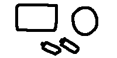

Say you have to make a pocket radio. You have to include a circuit board, a speaker, and two AA batteries.

a circuit board, a speaker, and two AA batteries

Designing *as little as possible*, you'd probably go with an arrangement like this:

{.theme-invert}
