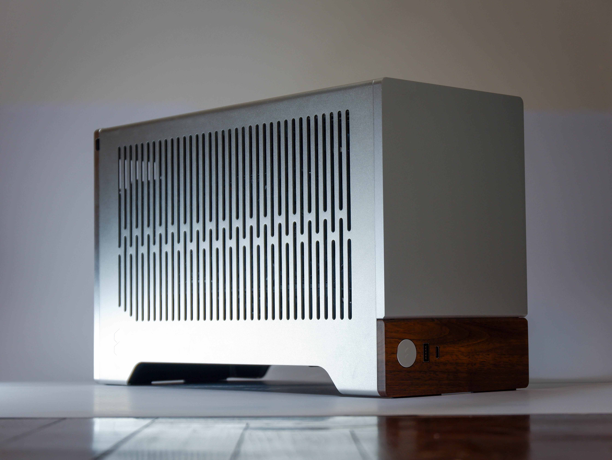

My first desktop computer was built in March of 2021. It was a modest build at the time, though it is rather dated by today's standards. Don't get me wrong—the Ryzen 5 3600 paired with a 1660 Super is completely viable for most tasks, but it did struggle with some heavier applications, like games. I was not planning to replace my original build, in parts or as a whole, but completing my military service netted me some cash which I've decided to use to treat myself to a system that I'd be completely happy with.

During the last few months of my service, I obsessively hunted for deals, even going as far as negotiating prices with a storeowner in Singapore over a video call from Korea. Turns out, that was completely justified, as RAM prices surged to four times what I paid in just over two months. I assembled it on the 28th of February, 2026.

here it is

The specs are as follows. It runs Windows 11 and Mint.

| Specs | |
|:---|:---|
CPU  | <a href="https://pcpartpicker.com/product/4r4Zxr/amd-ryzen-5-9600x-39-ghz-6-core-processor-100-100001405wof" target="_blank" class="extlink">AMD Ryzen 5 9600X</a>
Mobo | <a href="https://pcpartpicker.com/product/DkFbt6/msi-mpg-b650i-edge-wifi-mini-itx-am5-motherboard-mpg-b650i-edge-wifi" target="_blank" class="extlink">MSI B650I</a>
Cooler | <a href="https://www.idcooling.com/product/detail?id=553&name=IS-53-XT%20BLACK" target="_blank" class="extlink">IS-53-XT</a>  
RAM  | <a href="https://pcpartpicker.com/product/HHLp99/klevv-fit-v-32-gb-2-x-16-gb-ddr5-6000-cl28-memory-kd5agu880-60b280f" target="_blank" class="extlink">Klevv 32 GB DDR5-6000 CL28</a>
SSD  | <a href="https://pcpartpicker.com/product/jhjv6h/crucial-p510-1-tb-m2-2280-pcie-50-x4-nvme-solid-state-drive-ct1000p510ssd8" target="_blank" class="extlink">Crucial 1 TB M.2 PCIe 5.0 NVMe</a>
GPU  | <a href="https://pcpartpicker.com/product/PxG2FT/gigabyte-windforce-oc-sff-geforce-rtx-5070-12-gb-video-card-gv-n5070wf3oc-12gd" target="_blank" class="extlink">Gigabyte RTX 5070 12 GB (OC)</a>
PSU  | <a href="https://pcpartpicker.com/product/TsTZxr/corsair-sf750-2024-750-w-80-platinum-certified-fully-modular-sfx-power-supply-cp-9020284" target="_blank" class="extlink">Corsair SF750</a>
Case | <a href="https://pcpartpicker.com/product/kqHqqs/fractal-design-terra-mini-itx-desktop-case-fd-c-ter1n-02" target="_blank" class="extlink">Fractal Design Terra</a>

# Pictures

  <button class="carousel-btn carousel-btn-prev" data-action="prev" aria-label="Previous slide">❮</button>
  

    
    
    
  

  <button class="carousel-btn carousel-btn-next" data-action="next" aria-label="Next slide">❯</button>

  <button class="carousel-btn carousel-btn-prev" data-action="prev" aria-label="Previous slide">❮</button>
  

    
    
    
  

  <button class="carousel-btn carousel-btn-next" data-action="next" aria-label="Next slide">❯</button>

  <button class="carousel-btn carousel-btn-prev" data-action="prev" aria-label="Previous slide">❮</button>
  

    
    
    
  

  <button class="carousel-btn carousel-btn-next" data-action="next" aria-label="Next slide">❯</button>

# Address me

You may have noticed the peculiar white pieces that are stuck onto my components. What are they? What purpose do they serve?

The Fractal Terra is a very popular case, but is also notorious for its airflow issues. At a shorter height than other cases with comparable overall volume, it infamously has no room for top-mounted fans, putting the burden on a single optional fan at the bottom to move air through the entire chassis, which is already tightly packed with parts.

Naturally, this prompted the SFFPC community to make <a href="https://www.printables.com/model/1065941-fractal-terra-cpu-fan-duct-92mm" target="_blank" class="extlink">various</a> <a href="https://www.printables.com/model/902873-fractal-terra-92mm-fan-top-mount" target="_blank" class="extlink">solutions</a> in attempts to bring temps down, even marginally. I figured I'd try the same by designing a CPU fan duct—as well as what I'd like to call a GPU curtain mod.

## Goals

My careful part selection meant that I did not have a problem with my thermals, nor were the acoustics annoying. In fact, the graphics card fans remain off during general usage and the CPU cooler comfortably handles the 65W TDP of my processor. Therefore, it's important to recognise that I was not attempting to solve a problem out of necessity here. This was an experiment above all, and my main objective was to find out how much I could reduce my temps/noise using passive elements to redirect the existing airflow from my components.

## Methodology

Testing was done using FurMark2's 1440p preset testing, Assetto Corsa benchmarks, and actual gameplay for The Finals and Deadlock, recorded using RTSS. PBO and 105W TDP mode were disabled. The GPU uses a custom fan curve but was otherwise left stock. Ambient temperature was kept at 28°C. Because deliberate stress tests like FurMark will always use whatever thermal headroom it has, I don't find those test results very useful or meaningful over realistic scenarios where fan RPM (and thus noise) could be lowered by implementing these mods.

# GPU curtain mod

I figure most people would be more interested in this one, so I will discuss it first. The idea behind this contraption was to compartmentalise the volume inside the case, reserving the side panel vents exclusively for the graphics card intake fans.

  <button class="carousel-btn carousel-btn-prev" data-action="prev" aria-label="Previous slide">❮</button>
  

    <!--  -->
    
    
    
  

  <button class="carousel-btn carousel-btn-next" data-action="next" aria-label="Next slide">❯</button>

some prototypes i used for measurements

### Why not just use a duct?

If I were to implement <a href="https://www.reddit.com/r/FormD/comments/1gqkydx/first_sff_build_testing_a_gpu_fan_duct/" target="_blank" class="extlink">a duct that matches the size of the card</a>, fresh air from the side panel would 'leak' into the cavity below the GPU due to the negative pressure generated by the bottom fan. This means that the fan's efficiency would be compromised; instead of extracting hot air from within the case, it circulates air in a tiny loop that does nothing for the entire case. By partitioning the fan from the side panel vents, it enables the exhuast fan to purely move hot air generated by the GPU and PSU above it.

not a definitive test whatsoever, just a visualisation

Additionally, I was paranoid of the possibility of the hot exhaust from the GPU recirculating back to its own intake. Although I expected such a phenomenon to have no meaningful impact on temperature whatsoever, I whipped up a CFD sim to see if this was actually happening. While the model isn't accurate enough to generate anything optimised, it does provide some neat visualisations.

  <button class="carousel-btn carousel-btn-prev" data-action="prev" aria-label="Previous slide">❮</button>
  

    
    
    
  

  <button class="carousel-btn carousel-btn-next" data-action="next" aria-label="Next slide">❯</button>

regions of interest in white rectangles, the left half should be ignored

## Results

### FurMark (1 min)
|||||
|:--------|:-----:|:---:|:--------:|
|         | **SCORE** | **FPS** | **TEMP MAX** |
| Without | 12080 | 202 | 75°C       |
| With    | 12204 | 203 | 74°C       |
| Open    | 12195 | 202 | 75°C       |

### Assetto Corsa (benchmark ~3 min)

||||||
|:--------|:-------:|:--------:|:-------:|:--------:|
|         | **FPS AVG** | **0.1% LOW** | **FPS MAX** | **TEMP AVG** |
| Without | 366     | 31       | 510     | 64°C       |
| With    | 370     | 80       | 590     | 61°C       |
| Open    | 372     | 73       | 587     | 60°C       |

### The Finals (gameplay ~10 min)

||||||
|:--------|:-------:|:--------:|:-------:|:--------:|
|         | **FPS AVG** | **0.1% LOW** | **FPS MAX** | **TEMP AVG** |
| Without | 181     | 121       |         | 61°C       |
| With    | 187     | 123       |         | 57°C       |
| Open    | 188     | 130       |         | 55°C       |

As we can see, there isn't a dramatic difference enabled by the curtain mod, but a ~3°C drop in temps at similar or better framerates is a win I'll take. It seems that the curtain mod does not quite have the same effect as simply opening the case up altogether, which is to be expected.

Since this mod mainly affects the dynamics of hot air inside the case, it should have a negligible impact on the initial 'spike' when the GPU is first introduced to load. Once the case is saturated with hot air, only then should the partition do its thing. This theory seems to check out with the fact that longer tests under sustained load (The Finals) showed a more significant variance in results between the three configurations.

# CPU fan duct

Honestly, this has been done to death by so many individuals that I considered leaving this section out altogether. There is clear evidence this works and mine was no different. I'll let the pictures talk instead.

## Details

layer lines

slot for fan cable

## Iterations

  <button class="carousel-btn carousel-btn-prev" data-action="prev" aria-label="Previous slide">❮</button>
  

    
    
    
  

  <button class="carousel-btn carousel-btn-next" data-action="next" aria-label="Next slide">❯</button>

sorry for bad quality. might replace with renders

  <button class="carousel-btn carousel-btn-prev" data-action="prev" aria-label="Previous slide">❮</button>
  

    <!--  -->
    
    
  

  <button class="carousel-btn carousel-btn-next" data-action="next" aria-label="Next slide">❯</button>

before/after top surface ironing

# Conclusion

While the stock performance of the Ryzen 9600X and RTX 5070 was already decent, I do believe that these modifications provide tangible value. The Terra is a beautiful case with a great build experience, I wasn't going to let its subpar thermal performance keep me from purchasing it.

Should you make your own? If you find yourself staring at RivaTuner numbers more than the scoreboard in your games, I think making these airflow mods would be a fun and easy project. Having a 3D printer does make things easier, but cardboard will get you 99% of the way as well. If you wish your fan curves were a bit more aggressive, you could pair it with undervolting to make the GPU silent most of the time.

I'm just happy that it worked, man. 

## Downloads

- [GPU curtain (.3mf)](../../../assets/blog/work/desktop/GPUscreen.3mf)
- [CPU fan duct (.3mf)](../../../assets/blog/work/desktop/FanDuct.3mf)

I will update these to STEP files once they are cleaned up a bit. Sorry!

