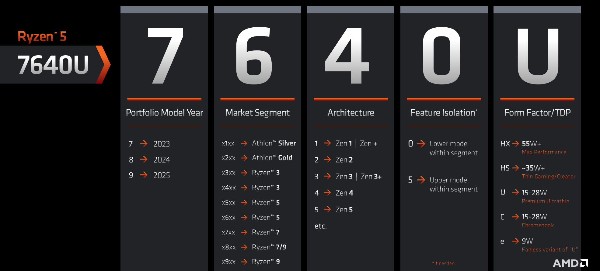
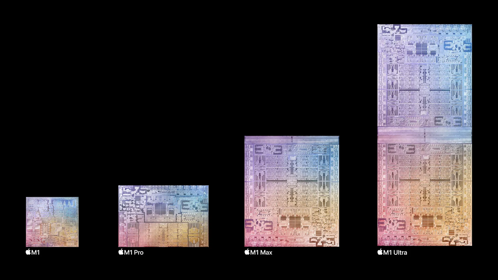

Silicon is ubiquitous! I often get asked to help configure different systems, but this industry of making rocks think has been so dynamic and fast-moving that what little knowledge I had was apparently outdated.

As I tried to catch up, it occured to me that such a situation was relatable to many--this is bad. It is important that consumers understand what they are buying, without having to be an expert. A good naming scheme enables this, allowing buyers to be informed and not misled or overwhelmed, or otherwise feel incompetent. A good naming scheme
- is honest.
- is intuitive.
- is jargon-less and succint, yet thorough.
- is not language-bound.
- is long-lasting.
 
Let's take a look at how different chipmakers name and categorise their products, ranking them in the process. It's the chips of the personal computing space that one would make the most use of understanding, so those are what we'll focus on.

  
Complete tier list — click to expand

  <table class="mmt" style="width:23em">
    <tr><td style="padding:0.5em; width:3em" class="c bg-re-2">S</td><td class="ppl"></td></tr>
    <tr><td style="padding:0.5em" class="c bg-or-2">A</td><td class="ppl"><a href="#apple">Apple silicon</a><a class="mml" href="#nvidia">Nvidia GeForce</a></td></tr>
    <tr><td style="padding:0.5em" class="c bg-ye-2">B</td><td class="ppl"></td></tr>
    <tr><td style="padding:0.5em" class="c bg-gr-2">C</td><td class="ppl"><a href="#intel">Intel Core</a></td></tr>
    <tr><td style="padding:0.5em" class="c bg-bl-2">D</td><td class="ppl"><a href="#amd">AMD Ryzen</a><a class="mml" href="#qualcomm">Qualcomm Snapdragon</a></td></tr>
    <tr><td style="padding:0.5em" class="c bg-pu-2">F</td><td class="ppl"></td></tr>
  </table>

# Intel

We will first look at Intel's *Intel Core* lineup, which replaced Pentium as Intel's main consumer CPU line.

Doing a web search for 'Intel Core processor naming scheme' gives us two main results: <a href="https://www.intel.com/content/www/us/en/processors/processor-numbers.html" target="_blank" class="extlink">A Brief Guide to Our Latest Processor and Naming Updates</a> and <a href="https://www.intel.com/content/www/us/en/gaming/resources/gaming-processor-names.html" target="_blank" class="extlink">Intel® Processor Names for Gaming Computers</a>. The second article is full of the word 'gaming', but it is comprehensive enough and not only for gamers. The two are similar in content.

Their current flagship desktop CPU name looks like this:<a href="#rfn:1" id="fn:1" class="footnote">1</a>

<pre class="c" style="overflow: auto; width:25em; margin:auto">
Intel® Core™ i9 processor 14900K
</pre>

> As a rule, the brand will come first, followed by the processor family, then the processor number—which contains the processor’s generation and SKU numbers—and, in some cases, the product line suffix.

The brand modifier `i_` is an iconic term that serves its purpose excellently, managing to penetrate and reside in the minds of the general consumer since its introduction in 2010. Ask any person and they could probably tell you an i7 is a 'good' processor. Despite i3 being conveniently left out in the article, there are four tiers: i3, i5, i7, and i9, with the last one only introduced in 2017. Very intuitive.

In the above example, `14` indicates generation, while `900` is the SKU number. In both, higher is better. While not immediately transparent, this is a good enough formula anyone could use to compare two products quickly. Big number, big good.

The suffix is opaque, with arbitrary letters denoting some arbitrary variation. Below is a non-comprehensive list taken from <a href="https://www.intel.com/content/www/us/en/support/articles/000058567/processors/intel-core-processors.html" target="_blank" class="extlink">Intel's documentation</a>; as you can see, it's a complete mess, even after I picked the most useful.

|   |   |
|:-:|:--|
| K | Unlocked |
| S | Special edition |
| F | Requires discrete graphics |
| G | Includes discrete graphics on package |
| T | Power-optimised lifestyle (??) |
| X | Unlocked, High End |
|   |   |
| H | High performance for mobile |
| U | Mobile power efficient |
| Y | Mobile extremely low power |
| P<a href="#rfn:a" id="fn:a" class="footnote">*</a> | Performance optimised for thin and light laptops

<a href="#fn:a" id="rfn:a" class="reversefootnote mr">*</a>As far as I could tell, P has been deprecated in favour of H.

Still, this is fine. In fact, I would argue that it was smart of Intel to marginalise the series name by including them in the form of a single letter suffix. By putting such indication in the periphery, inexperienced buyers are less likely to be overwhelmed. If you are the kind of person to have the need and knowledge of an overclock-enabled CPU, you wouldn't have a problem with this system either.

## Intel, again

Bad news. All of the above is now outdated. Shame. At the end of 2023, Intel announced a revision of their naming scheme for Core series processors. This has made a lot of people very angry and been widely regarded as a bad move. As of writing this, we are stuck in an awkward transitionary phase where consumers are faced with two different rules from the same company. It's a whole mess.

We now have something like this:
<pre class="c" style="overflow: auto; width:25em; margin:auto">
Intel® Core™ 7 processor 150U
</pre>

Changes:

- The 'i' branding has been dropped. Number is called a 'Brand Level' now.
- Generation has been reset to 1. Called 'Series' now.
- SKU has been shortened to two digits, bringing the overall processor number to three digits (previously 4–5).

Overall, this doesn't change much. Why did they bother?

### What in the Ultra

<pre class="c" style="overflow: auto; width:25em; margin:auto">
Intel® Core™ Ultra 9 processor 185H
</pre>

It's because of the 'Ultra' name that was newly introduced. Let's see what it means.

> In addition to Intel® Core™ processor, we have also introduced Intel® Core™ Ultra processors. Designed for premium laptops, these advanced processors will usher in the age of the AI PC by featuring Intel’s first integrated neural processing unit, or NPU, for power-efficient AI acceleration and local inference on PC.

*...what?*

If we look past the marketing jargon, the brand reboot makes sense. Intel has adopted the chiplet architecture for its latest <a href="https://en.wikipedia.org/wiki/Meteor_Lake" target="_blank" class="extlink">Meteor Lake</a> microarchitecture, finally abandoning monolithic silicon dies. This conveniently comes with NPUs as they say above, just in time for the AI fever.

Clearly, Intel wants to distinguish their disaggregated multi-chip module (MCM) processors from their existing products, so the Ultra branding was introduced. While they were at it, they thought it was a good time to refresh the mainline series' names as well. Fair enough, but there are certain hiccups in their execution that are simply infuriating:

1. An Ultra processor is never necessarily better than a non-Ultra one. Horrid.

2. There is an overlap between Core Ultra 5 / 7 and Core 5 / 7.

3. Every Raptor Lake chip followed the old convention, but the <a href="https://en.wikipedia.org/wiki/Raptor_Lake#Raptor_Lake-U_Refresh" target="_blank" class="extlink">Raptor Lake-U Refresh</a> debuted under the new naming scheme as 'Intel Core 7 150U' and such. WHY?

4. What the NPU provides to the end user is either useless or underwhelming, although this should change as time passes and software takes better advantage of the hardware capabilities.

Despite such radical changes, the processor numbering system did not change much so my opinion remains unchanged.

(With these changes also came the 'N' prefix, but I won't even bother discussing that.)

## Overall thoughts

Intel's influence on the market has made even the average Joe aware of the i_ moniker, only for them to throw it away. Either way, the 3/5/7/9 tier numbering has a fundamental problem in that it does not differentiate generations. Tiering can be a good gauge of performance, but only if you are looking at models from comparable generations. This matters less when one is choosing a brand-new computer, but the second-hand market is rampant with sellers who take terribly underpowered, older i7's and pose them as being more performant than a newer gen i5. It is truly saddening to hear stories of people who talk about getting a steal of a used PC, only for me to find out that it's something like an i7-6700K (granted, that is quite usable).

Given a simple introduction, the processor number format is uncomplicated to understand and reasonably coherent. Regrettably, no part of a product's name indicates some absolute measure of performance, but that's the norm, and relative performance is what consumers look for anyway.

While the controversial naming refresh is justified, the Ultra designation feels like a knee-jerk reaction to the emergence of AI. Some Ultra models can be outperformed by non-Ultra processors, so what does the term even mean to the end user? To me, it's little more than a marketing gimmick.

Overall, it's hard to mix two products up, and most of the terms mean something. Numbering is logical, even if it requires a manual to understand. Intel's naming scheme of their *Intel Core* series CPUs would earn itself a solid B tier, **if and only if** Ultra was out of the equation. Otherwise, C tier it is.

# AMD

AMD's main consumer desktop/laptop processor brand is AMD *Ryzen*.

Search engines do not return an official guide from AMD when queried 'AMD Ryzen processor naming scheme', so deduct some imaginary points for that. A <a href="https://www.amd.com/en/products/specifications/processors.html" target="_blank" class="extlink">spec sheet</a> exists, but this has close to zero value when it comes to deciphering their processor names.

Their current flagship desktop CPU name looks like this:

<pre class="c" style="overflow: auto; width:25em; margin:auto">
AMD Ryzen™ 9 9950X
</pre>

Because there is no official guide, let me include another example to aid understanding:

<pre class="c" style="overflow: auto; width:25em; margin:auto">
AMD Ryzen™ 5 3600
</pre>

The lone number denotes the segment. It's an open secret that 3/5/7/9 are used to leverage on Intel's already ubiquitous branding. AMD does not deserve flak for this. No room for superfluous pride that would only confuse consumers. Could you imagine if they went with even numbers instead and made '10', only for Intel to introduce '11' the next year and so on?

The first number (yellow) in the processor name is the generation. This is directly linked to architecture. Higher is better.

The next digit is the performance level, ranging from 3 to 9.<a href="#rfn:2" id="fn:2" class="footnote">2</a> Again, higher is better. This and segment both indicate performance, so it's no surprise that there is a relation. Level 3 usually belongs to Ryzen 3, levels 5 and 6 to Ryzen 5, and so on. However, this is rather arbitrary and you are often faced with something stupid like 8 belonging to both Ryzen 7 and Ryzen 9. Despite this, it is simple and the added granularity is welcome.

The final two digits constitute the model number, leaving room for speed bumps or SKU differentiation if needed. As a whole, these four numbers work very similarly to Intel's formula, making it decent.

Finally, AMD yet again takes from Intel's book for its suffix, condensing information into a single letter of the alphabet. I won't list them all, but they are just as non-intuitive as Intel's, despite being slightly more coherent.

### In motion, in 3D

One suffix, however, stands out from the rest: 'X3D'. The X3D title is reserved for CPUs that are supercharged with extra L3 cache, benefitting from *AMD 3D V-Cache™ Technology* which just means vertically stacked L3 cache modules. The performance lead that these CPUs have over their competition has made the term widely used. The special label takes full advantage of the chips' popularity in a marketing move that I consider to be very successful. It does not contradict any part the original naming scheme and does not cost any clarity. Good job, AMD.

## AMD, again.. again

Take a look at this horrifying image.

the horrifying image

Notice anything wrong? It invalidates whatever we just established. This image explains the new naming scheme starting from the 7000 series, **for the mobile line only**.

Why on Earth would they do this??

Generation has been sneakily replaced to year of release. If we look past the completely arbitrary indexing of numbers to years,<a href="#rfn:b" id="fn:b" class="footnote">†</a> it doesn't seem like this changes much. Indeed, this change is trivial, but only for the highest-end models. Minor refreshes of previous generation CPUs have traditionally reflected their architecture in their title, for example the upcoming 5800XT, upgrade of the 5800X from 2020. Under this system, however, AMD can easily get away with calling a 7640U refresh a 9640U processor, making it sound much better than it truthfully is. Awful.

Market segment is the same as performance level and deserves the same praise and criticism.

Architecture is new. I suppose it is nice to see it being explicit about itself, even if that came at the cost of jeopardizing the entire established system in pursuit of a worse one.

Feature isolation is also effectively the same as differentiator digits. Same goes for the form factor suffix.

<a href="#fn:b" id="rfn:b" class="reversefootnote mr">†</a>Funnily enough, starting from year 4 (2020), you can add each digit of the year of the generation to get the generation itself (e.g. 2 + 0 + 2 + 3 = 7). This is of course just a coincidence and they really did it to avoid regressing to smaller starting numbers.

## Deep sigh into the distance

We aren't done yet. Remember Ultra? The exact same shenanigan goes on over at Team Red with the *AMD Ryzen AI 300* series. As of writing, there are only two models out:

<pre class="c" style="overflow: auto; width:25em; margin:auto">
AMD Ryzen™ AI 9 HX 370
</pre>
 
<pre class="c" style="overflow: auto; width:25em; margin:auto">
AMD Ryzen™ AI 9 365
</pre>

The hell is this? The colour vomit should already suggest this is a disaster, but let's break it down anyway.

`AI` is new. I maintain that this is jumping onto a hype train and thus a marketing move that actively deteriorates the integrity of the naming scheme.<a href="#rfn:3" id="fn:3" class="footnote">3</a> But let's quickly move on since that's been discussed.

`9` is the segment as usual. I'm not sure why 3 was chosen for a first-gen product, but the digit is equivalent to the generation digit in other systems. `6` and `7` refer to performance level and the final digit is the SKU differentiator.

So what the hell is `HX` doing in the middle of all that? Apparently, '9' and '9 HX' are distinct segments in AMD's <a href="https://www.amd.com/en/products/processors/laptop/ryzen.html#:~:text=AMD%20Ryzen%E2%84%A2%20Processor%20Portfolio" target="_blank" class="extlink">portfolio</a>, bringing the complete roundup to 3, 5, 7, 9, AI 9, and AI 9 HX. Yes. It's not a form factor or TDP suffix! The 'HX' in Ryzen 9 7945HX is distinct from that in Ryzen AI 9 HX 370.

What about the actual form factor? They have been cut--OEMs can now configure the TDP however they see fit. They can also hide that information in some obscure footnote. I cannot even fathom how such a ridiculous decision was made.

What this means is that 9 and 9 HX effectively mean 9 and 11, but even AMD must have thought 11 was too far. If that's the case, why not something like:

<pre class="c" style="overflow: auto; margin:auto">
AMD Ryzen™ AI 9 9700     /     AMD Ryzen™ AI 7 9650
</pre>

I even kept the 'AI'! But try saying "Ryzen AI nine ninety-seven hundred" out loud. So, if suffixes are somehow useless now, why not:

<pre class="c" style="overflow: auto; margin:auto">
AMD Ryzen™ 9 9700AI      /     AMD Ryzen™ 7 9650AI
</pre>

If we are willing to break the status quo, we can bring back the 3, and the extra 0 can be tossed to produce "Ryzen nine three-seventy AI", which I think is much better:

<pre class="c" style="overflow: auto; margin:auto">
AMD Ryzen™ 9 370AI      /     AMD Ryzen™ 7 365AI
</pre>

## Overall thoughts

AMD's desktop CPU series has a solid naming scheme that was strategically created to ease Intel customers into buying Ryzen, given Intel's market dominance at the time of Ryzen's creation. It affirms the higher-is-better rule and makes comparisons between Ryzen products relatively easy.

However, the mobile lineup compromised any consistency they had, instead introducing a more complex and arguably dysfunctional framework. Furthermore, keeping the formula different from the main desktop line is sin. You know you're doing something wrong when this <a href="https://i.imgur.com/u5cCtha.png" target="_blank" class="extlink">gag gift of an object</a> had to be made.

Did they have to make it even more convoluted with their AI lineup? They did anyway.

AMD fails many tests on what it takes to create a *good* naming scheme. While it may not be trying to be mendacious, the needless complexities sure feel unfair. Clouding customers' judgement with a wall of unintuitive numbers is just going to disinterest them, forcing the use of even more buzzwords. I understand that this approach might be favourable to shareholders, but looking at the system in a vacuum, *Ryzen* gets a D from me.

# Apple

A relatively new player, Apple's offerings come in the form of *Apple silicon*, specifically the 'M' series.

These processors cannot be purchased standalone, but come integrated in <a href="https://support.apple.com/en-us/116943" target="_blank" class="extlink">various hardware</a>. Because of this, examining this will be slightly different.

Though M4 was just released, Apple's most powerful chip as of now is named:

<pre class="c" style="overflow: auto; width:25em; margin:auto">M2 Ultra</pre>

I'm not going to bother colour-coding this because it's so minimal. `2` is generation. `Ultra` is one of four versions in a generation: the base model, Pro, Max, and Ultra.

the graph plots itself

That's it! An M2 Max is better than an M2 Pro, M3 is better than M1, M2 Ultra is better than M3 Pro... It cannot get simpler than that, and consumers appreciate the clarity. In fact, I can include every M-series chip in a small table:

<!--
| Name     | Release | CPU Cores (P/E) | GPU Cores | NPU (TOPS) | Memory Bandwidth |
|:---------|:-------:|:---------------:|:---------:|:----------:|:----------------:|
| M1       | Q4 2020 | 4 / 4           | 7, 8      | 11         | 68.25 GB/s       |
| M1 Pro   | Q4 2021 | 6, 8 / 2        | 14, 16    | 11         | 204.8 GB/s       |
| M1 Max   | Q4 2021 | 8 / 2           | 24, 32    | 11         | 409.6 GB/s       |
| M1 Ultra | Q1 2022 | 16 / 4          | 48, 64    | 22         | 81.92 GB/s       |
| M2       | Q2 2022 | 4 / 4           | 8–10      | 15.8       | 102.4 GB/s       |
| M2 Pro   | Q1 2023 | 6, 8 / 2        | 16, 19    | 15.8       | 204.8 GB/s       |
| M2 Max   | Q1 2023 | 8 / 4           | 30, 38    | 15.8       | 409.6 GB/s       |
| M2 Ultra | Q2 2023 | 16 / 8          | 60, 76    | 31.6       | 819.2 GB/s       |
| M3       | Q4 2023 | 4 / 4           | 8, 10     | 18         | 102.4 GB/s       |
| M3 Pro   | Q4 2023 | 5, 6 / 6        | 14, 18    | 18         | 153.6 GB/s       |
| M3 Max   | Q4 2023 | 10, 12 / 4      | 30, 40    | 18         | 409.6 GB/s       |
| M4       | Q2 2024 | 3, 4 / 6        | 10        | 38         | 120.0 GB/s       |
-->

<table>
  <tr><th class="l">Name</th><th class="c">Release</th><th class="c">CPU Cores (P/E)</th><th class="c">GPU Cores</th><th class="c">NPU (TOPS)</th><th class="c">Memory Bandwidth</th><th></th></tr>
  <tr><td>M1</td><td class="c pr0">Q4 2020</td><td class="r" style="padding-right: 4rem">4 / 4</td><td class="c pr0">7, 8</td><td class="l" style="padding-left: 4rem">11</td><td class="c pr0">68.25 GB/s</td><td></td></tr>
  <tr><td>M1 Pro</td><td class="c pr0">Q4 2021</td><td class="r" style="padding-right: 4rem">6, 8 / 2</td><td class="c pr0">14, 16</td><td class="l" style="padding-left: 4rem">11</td><td class="c pr0">204.8 GB/s</td><td></td></tr>
  <tr><td>M1 Max</td><td class="c pr0">Q4 2021</td><td class="r" style="padding-right: 4rem">8 / 2</td><td class="c pr0">24, 32</td><td class="l" style="padding-left: 4rem">11</td><td class="c pr0">409.6 GB/s</td><td></td></tr>
  <tr><td>M1 Ultra</td><td class="c pr0">Q1 2022</td><td class="r" style="padding-right: 4rem">16 / 4</td><td class="c pr0">48, 64</td><td class="l" style="padding-left: 4rem">22</td><td class="c pr0">81.92 GB/s</td><td></td></tr>
  <tr><td>M2</td><td class="c pr0">Q2 2022</td><td class="r" style="padding-right: 4rem">4 / 4</td><td class="c pr0">8–10</td><td class="l" style="padding-left: 4rem">15.8</td><td class="c pr0">102.4 GB/s</td><td></td></tr>
  <tr><td>M2 Pro</td><td class="c pr0">Q1 2023</td><td class="r" style="padding-right: 4rem">6, 8 / 2</td><td class="c pr0">16, 19</td><td class="l" style="padding-left: 4rem">15.8</td><td class="c pr0">204.8 GB/s</td><td></td></tr>
  <tr><td>M2 Max</td><td class="c pr0">Q1 2023</td><td class="r" style="padding-right: 4rem">8 / 4</td><td class="c pr0">30, 38</td><td class="l" style="padding-left: 4rem">15.8</td><td class="c pr0">409.6 GB/s</td><td></td></tr>
  <tr><td>M2 Ultra</td><td class="c pr0">Q2 2023</td><td class="r" style="padding-right: 4rem">16 / 8</td><td class="c pr0">60, 76</td><td class="l" style="padding-left: 4rem">31.6</td><td class="c pr0">819.2 GB/s</td><td></td></tr>
  <tr><td>M3</td><td class="c pr0">Q4 2023</td><td class="r" style="padding-right: 4rem">4 / 4</td><td class="c pr0">8, 10</td><td class="l" style="padding-left: 4rem">18</td><td class="c pr0">102.4 GB/s</td><td></td></tr>
  <tr><td>M3 Pro</td><td class="c pr0">Q4 2023</td><td class="r" style="padding-right: 4rem">5, 6 / 6</td><td class="c pr0">14, 18</td><td class="l" style="padding-left: 4rem">18</td><td class="c pr0">153.6 GB/s</td><td></td></tr>
  <tr><td>M3 Max</td><td class="c pr0">Q4 2023</td><td class="r" style="padding-right: 4rem">10, 12 / 4</td><td class="c pr0">30, 40</td><td class="l" style="padding-left: 4rem">18</td><td class="c pr0">409.6 GB/s</td><td></td></tr>
  <tr><td>M4</td><td class="c pr0">Q2 2024</td><td class="r" style="padding-right: 4rem">3, 4 / 6</td><td class="c pr0">10</td><td class="l" style="padding-left: 4rem">38</td><td class="c pr0">120.0 GB/s</td><td></td></tr>
</table>

Wait a second. Why does the same chip come with different numbers of cores?

## The catch

Apple is not just a chip manufacturer. These processors always come packaged in their devices, so to get the full picture we have to investigate those products as well.

It is true--the same M3 chip can come with eight or ten cores depending on the configuration of the MacBook you're getting it with. Same goes for for the iPads. In fact, variations are present in every single M-series chip available. With this problem in mind, it's almost as if the M_ designations are only as good as 'Ryzen _', omitting the cryptic numbers that come after it and sweeping the details under the rug.

To their credit, Apple has strategies to explicate these details instead of hiding them:

1. Their website's comparison tool is solid, spelling out the differences across and within generations, models, and even product lineups. Seriously. Try comparing a thirteen-inch MacBook Air to the $10,000 Mac Pro. You can!

2. Apple controls the sales and packaging of all of their products. Plaques and labels make it obvious how many cores you are spending (a lot of) your money on, no matter where you purchase from.

Finally, their customers simply don't care. The same goes for other brands, but Apple especially so. All an average consumer needs to know is that Pro is better, Max is more better, and Ultra most better. Sure it's not thorough, but it does check every other box.

## Overall thoughts

Apple's M-series chip names are not perfect. Nevertheless, the uncluttered names are a refreshing take that only Apple can pull off. Their small lineup and distinct modus operandi enable such a manageable convention that somehow works quite well.

When choosing a product, one can find exactly what they want quickly, with the help of Apple's website. Customers *might* be confused by differing core counts on the same chip, but Apple's hand-holding approach quickly clears any doubt, catalysing the purchase process. This is a cheeky strategy but one I can get behind.

Apple's naming of their products is famously insufferable<a href="#rfn:4" id="fn:4" class="footnote">4</a> but this is the one exception, earning them a well deserved A tier--A for Apple.

*Now if only  could fix the rest...*

# Qualcomm

New chipmakers are disrupting the status quo. Qualcomm entering the mobile PC market isn't exactly new,<a href="#rfn:5" id="fn:5" class="footnote">5</a> but they only became serious contenders with the introduction of the *Snapdragon X* series chips.

*Note: these chips' atrocious names inspired me to write this entire thing.*

Since you made it this far, *reader*, let's play a game. I will not name their current best processor, instead listing all of them. Your job is to guess which is the best one, and the next best, and so on. Drag the pieces as you wish to rank them.

  
X1E-84-100

  
X1E-00-1DE

  
X1E-78-100

  
X1P-64-100

  
X1E-80-100

  
Answer — click to expand

  <table class="mmt">
    <tr><th class="l">Name</th><th class="c">Cores</th><th>Max clock</th><th>Boost clock</th><th>GPU (TFLOPS)</th><th>NPU (TOPS)</th></tr>
    <tr><td class="pr0">X1E-00-1DE</td><td class="c pr0">12</td><td class="c pr0">3.8GHz</td><td class="c pr0">4.3GHz</td><td class="c pr0">4.6</td><td class="c pr0">45</td></tr>
    <tr><td class="pr0">X1E-84-100</td><td class="c pr0">12</td><td class="c pr0">3.8GHz</td><td class="c pr0">4.2GHz</td><td class="c pr0">4.6</td><td class="c pr0">45</td></tr>
    <tr><td class="pr0">X1E-80-100</td><td class="c pr0">12</td><td class="c pr0">3.4GHz</td><td class="c pr0">4.0GHz</td><td class="c pr0">3.8</td><td class="c pr0">45</td></tr>
    <tr><td class="pr0">X1E-78-100</td><td class="c pr0">12</td><td class="c pr0">3.4GHz</td><td class="c pr0">   -   </td><td class="c pr0">3.8</td><td class="c pr0">45</td></tr>
    <tr><td class="pr0">X1P-64-100</td><td class="c pr0">10</td><td class="c pr0">3.4GHz</td><td class="c pr0">   -   </td><td class="c pr0">3.8</td><td class="c pr0">45</td></tr>
  </table>

Technically speaking, the full name should include the branding as well, but it doesn't help:

<pre class="c" style="overflow: auto; width:25em; margin:auto">
Snapdragon X Elite X1E-00-1DE
</pre>
 
<pre class="c" style="overflow: auto; width:25em; margin:auto">
Snapdragon X Plus X1P-64-100
</pre>

How do you screw up with this small of a lineup? I genuinely cannot understand.

`X` is branding. Fair enough. `1` is (or hopefully is) generation. Also fair.

`E` / `P` distinguishes Elite from Plus. Why they need this when 'Snapdragon X Elite' is spelled out is beyond me.

Despite how *obvious* it is, just in case you weren't able to instantly figure it out, the orange digits are the maximum possible clock speeds of each chip, multiplied by twenty... **unless it can boost to 4.3GHz**, because then it is 00. *Duh*. This is super intuitive and totally comprehensible.

The `100` has no purpose. It is simply there. Unless, of course, it's the `1DE` model.

Where is any mention of the GPU performance level? Sure, you can omit the core count and NPU performance if they are all the same, but the X1E-00-1DE and X1E-84-100 have better GPUs than the rest with no indication whatsoever.

What is the point of Elite and Plus? The X1E-78-100 lacks the boost clock the other Elite models have, but refuses to fall under Plus by virtue of its core count.

## Overall thoughts

Obnoxious. Qualcomm's entry into the market is exciting, bringing unprecedented efficiency to the Windows laptop market. But it is almost as if they don't want consumers to buy their products, or at least do so blindly.

I don't want to know what would happen when they introduce more models down the road. D tier.

# NVIDIA

Moving on to GPUs, *GeForce* is Nvidia's consumer graphics card brand.

Querying 'Nvidia GeForce naming scheme' yields plenty of third party results, but I'd still like to praise the official <a href="https://www.nvidia.com/en-us/geforce/graphics-cards/compare/" target="_blank" class="extlink">comparision tools</a> for being very comprehensive and well laid out. The only thing missing are benchmarks but I understand why no company would include that.

<pre class="c" style="overflow: auto; width:25em; margin:auto">
GeForce RTX 4090
</pre>

`RTX` as a prefix defines the product category. Every new GPU from Nvidia comes with RTX as they are cards with significant ray tracing capabilities. Older GTX cards are still sold by Nvidia, but only the 16 series cards.

The first two digits indicate the series. 40 is newer than 30, which is newer than 20. 16 is slightly awkward, as they were released alongside the 20 series. But they were targeted specifically at the mid-range market, and thus worse than the 20 series. This is okay! Recognise that while a new generation introduces a new series, the numbers are still tied to the technology being used, not date of release. A refresh of a 30 series card will still be called '30__' as long as it uses the Ampere architecture, along with relevant technology like PCIe Gen 4. The system keeps Nvidia honest.

The remaining two digits specify performance. 90 > 80 > 70 > 60 > 50. Simple as that.

You might have also seen something like '3060 Ti' or '2080 Super', or even '4070 Ti Super'. What's up with those?

### How do you pronounce 'Ti'

'Ti' is just reserved for models with a modest performance boost compared to the base model, usually CUDA cores or a few gigabytes of VRAM. 'Super' indicates a refresh meant to upgrade or replace the non-super versions. It too is a small spec bump, with more cores, VRAM, or a higher clock speed. The two, combined, give consumers more options, providing in-between tiers of products to pick from, as a full tier jump can be quite burdening.

## Overall thoughts

Nvidia is far from a saint. Their naming of GeForce graphics cards aren't free from sin either. For example, there exists two versions of the RTX 3050--one with 8 GB of VRAM and the other with 6 GB. Still, their convention is one of the rare ones with a backbone, having kept the same scheme since the 200 series from 2008.

The numbers are short and sweet, providing just the right amount of information. They are intuitive and roll off the tongue. A child could tell you 4090 is bigger and better than 2070. The suffixes might be cringey but never superfluous. Furthermore, that cringe is forgotten if you stick with it for a decade. Nvidia's *GeForce* belongs to A tier.

  <a href="#fn:1" id="rfn:1" class="reversefootnote mr">1</a>Up until ever so recently, the norm was something like 'Intel Core i7-8700K Processor', with 'processor' coming after the model. As stupid as the change is, this arrangement is technically obsolete, which is why I did not include it in the main section.

  <a href="#fn:2" id="rfn:2" class="reversefootnote mr">2</a>I am aware 1 and 2 are used, but they are usually reserved for Athlon processors, not Ryzen, which is why they were excluded. However, I am also aware of outliers such as the Ryzen 5 7235HS or Ryzen 3 5125C. Still, I chose not to discuss them considering these are extremely rare.

  <a href="#fn:3" id="rfn:3" class="reversefootnote mr">3</a>Maybe that's why a whole new scheme was introduced? So it could be abandoned once the craze subsides? I wouldn't be surprised.

  <a href="#fn:4" id="rfn:4" class="reversefootnote mr">4</a>Do you want an 'iPad Air' or an 'iPad Air' that's worse? How about the 'iPad Air' that's newer and better?

  <a href="#fn:5" id="rfn:5" class="reversefootnote mr">5</a>Windows on ARM has been a thing since Windows RT in 2012. More recently, Snapdragon-based CPUs were Qualcomm's entry into the Windows PC market back in 2018, under a partnership with Microsoft to bring Windows 10 to ARM.

