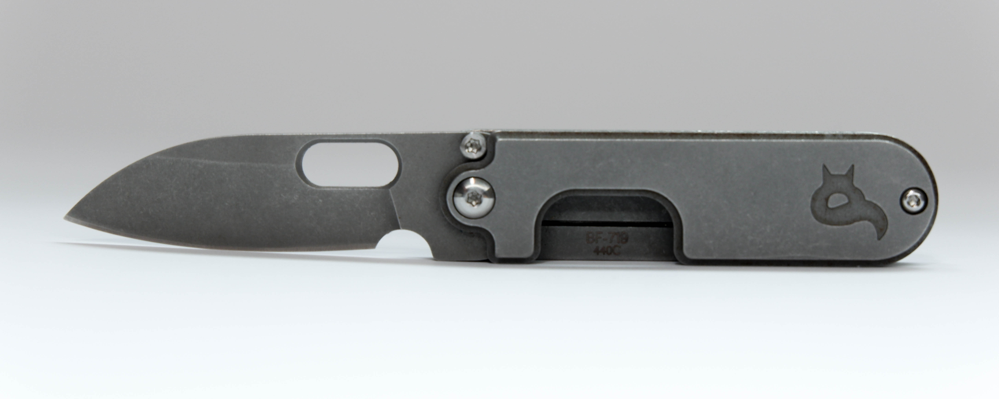
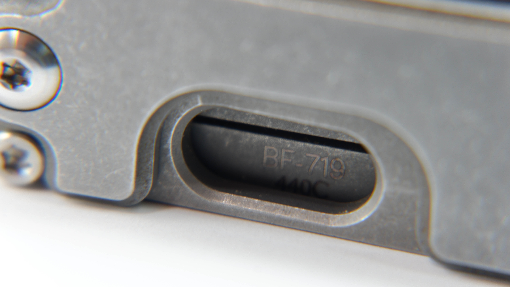
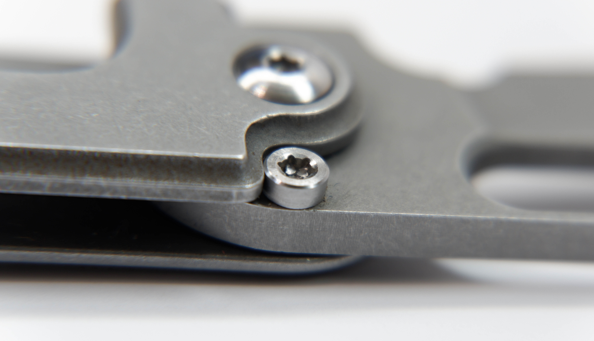
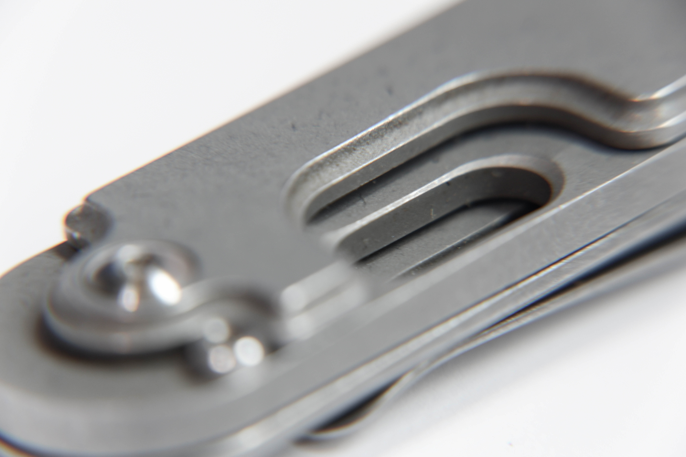
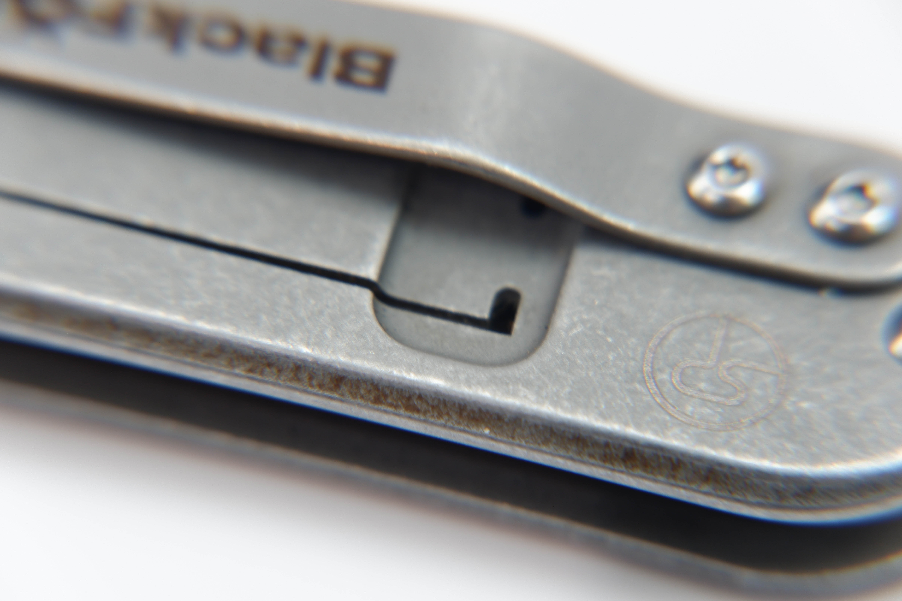
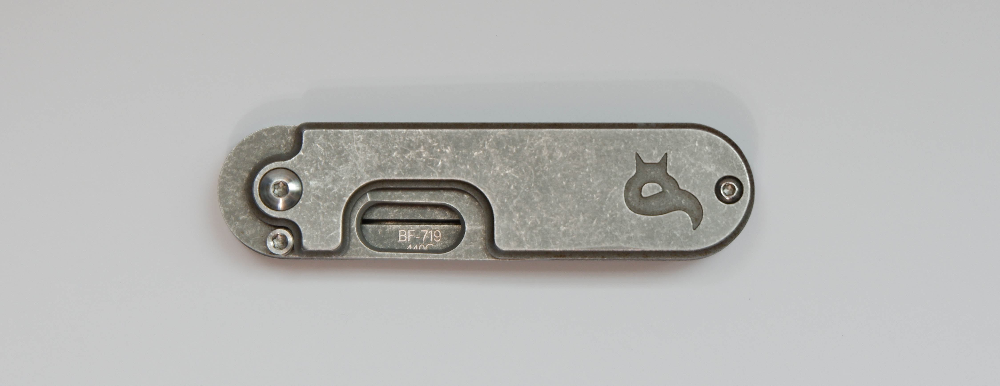

The pocket knife I use is the Blackfox Bean Gen 2. It's a slipjoint with EU regulations in mind, making it legal in most places. To be frank, I purchased this because it was cheap and looked great. The reduced design and simple lines alone made it a worthy successor to my Victorinox that was confiscated at an airport.

unfolded

The flat, stainless steel blade folds into the same 440C steel handle. All surfaces sport a nice stonewashed finish, leaving a pleasantly smooth texture. From what I can tell, the blade is somewhere between flat and hollow grind. The drop point shaped blade includes a oval thumb hole that captures both style and functionality.

440C is high carbon, martensitic stainless steel

The knife is adorned with three T8 screws near the pivot and four T6 screws towards the rear end. All but one are button heads, sitting flush with the surrounding metal. Because the nub on the blade is not a thumb stud but actually a stopper, it does away with the traditional thumb stud design and opts for a brutalist approach instead. 

socket head does the trick

## The good

Serge Panchenko did an excellent job playing with lines. Curves have the perfect radii, existing only where they have to. My favourite detail is the inverted fillet going across the entire handle cover. When folded, they illustrate a bunch of cascading lines going all the way from the front cover to the back frame.

The outstanding build quality is definitely a highlight. I have used the knife for over 4 years. The tolerances are still tight and there's barely any corrosion. 440C steel is pretty hard, so I haven't had to sharpen it yet. It's a well thought out design that's machined without compromise.

The slipjoint system is augmented by a ball detent mechanism, which is enabled by a cantilever type flat spring. This spring is none other than the frame itself, made by carving out a single U-shaped channel. Frame locks are ubiquitous, but this is a creative implementation of the same idea in a slipjoint.

the rounded edges distributes stress

## The bad

I have two main gripes with this knife. The first has to do with the user experience when folding and unfolding the knife. The ball detent is very potent. Good if you're into satisfying clicks, but bad if you're interested in one-handed operation. Flipping the blade out with one hand requires an awkward ritual where I unlatch the blade with my thumb, adjust my grip, then extend it all the way. To make room for the blade to pass, I cannot grip the knife securely in my hands, but rather have to pinch it between my thumb and fingers. Same story when it comes to closing, I'm forced to precariously cradle the blade in my palm lest I cut my fingers.

Folding and unfolding is the single most frequent interaction the user will have with the product. Maybe this is fine for experienced knife handlers, but I struggle to see why this had to be as unintutitive as it is.

Two, it does not close all the way:

what the fuck

## Measurements

|||
|:--------|:-------|
|Blade thickness   |29 mm   |
|Length (closed)   |77mm    |
|Length (open)     |129 mm  |
|Width             |19 mm   |
|Weight            |68 g    |
