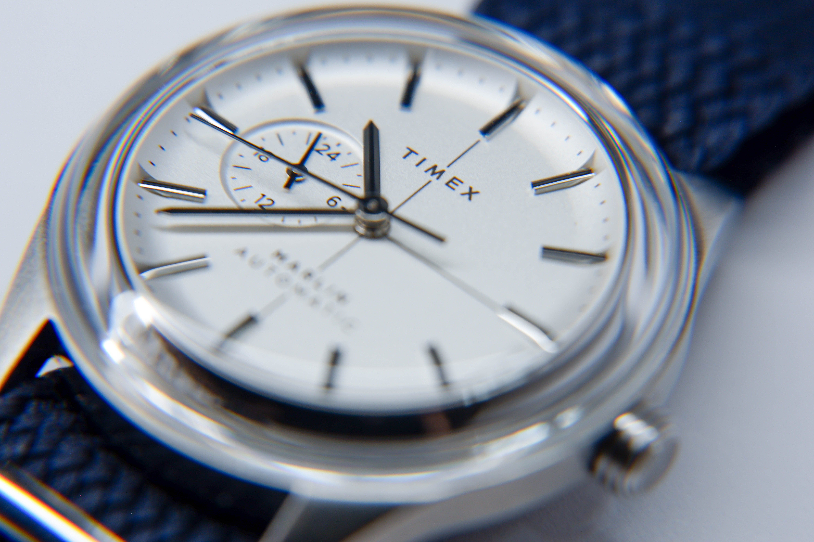

My daily watch of choice is the Timex Marlin Jet Automatic. Despite the jet moniker, the entire model family is a '60s Space Age reimagination of the classic Marlin silhouette. I was introduced to the classic Marlin by a friend and fell in love with the domed crystal. That made me dig through the Timex catalog before settling on this model, where I purchased it second hand (ha) while in the army. It was a tough find in Korea!

i love the bubble

The classic dome exists throughout generations of the Marlin and maintains the iconic bezel-less look when viewed from above. This is the defining design feature. If you don't like this, never get a Marlin. The crystal is acrylic, which is completely justified for the price and has its benefits. The original Marlin (among other vintage classics) used acrylic as well, so it's a vibe. 
