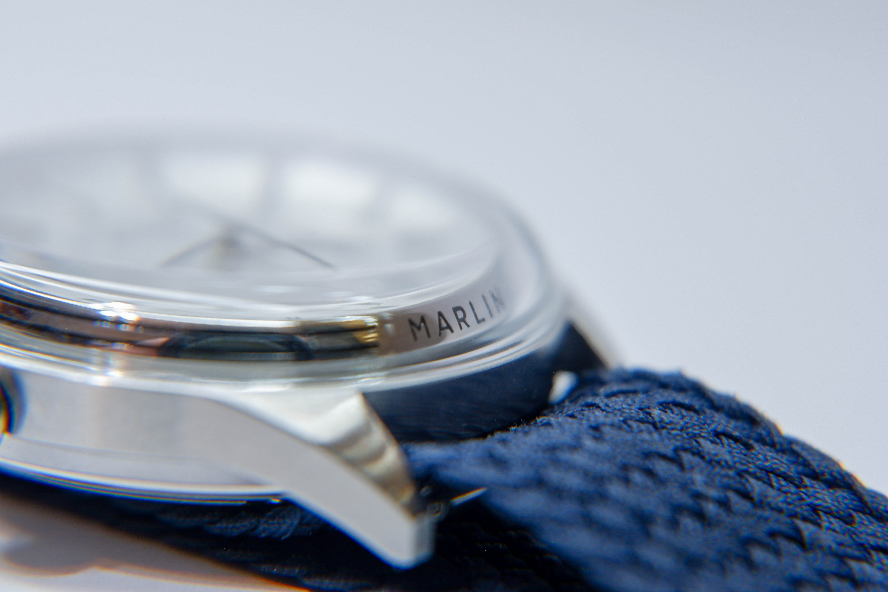
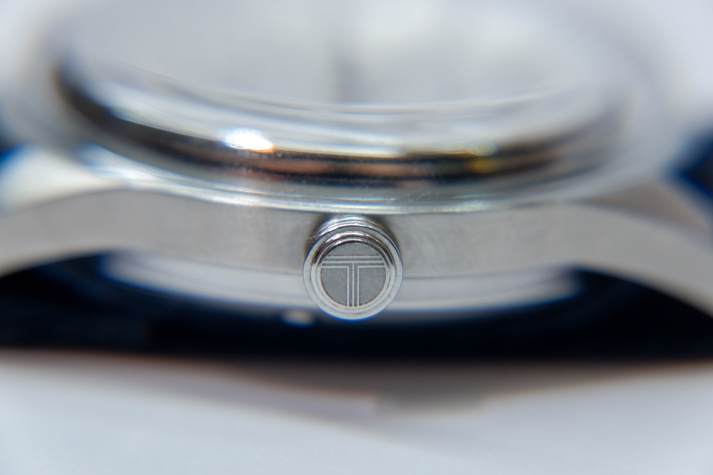
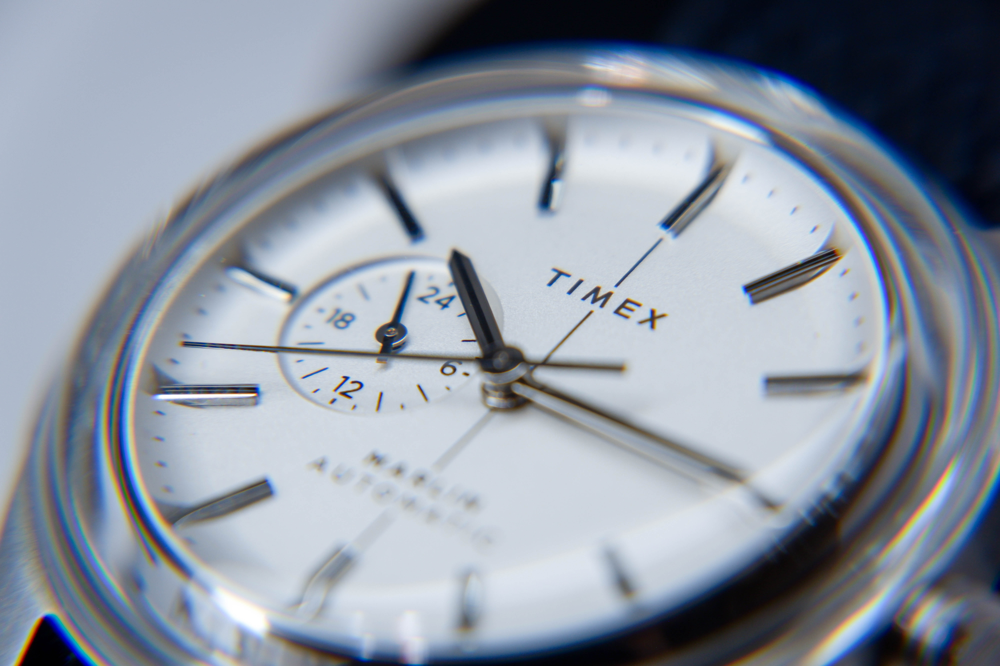
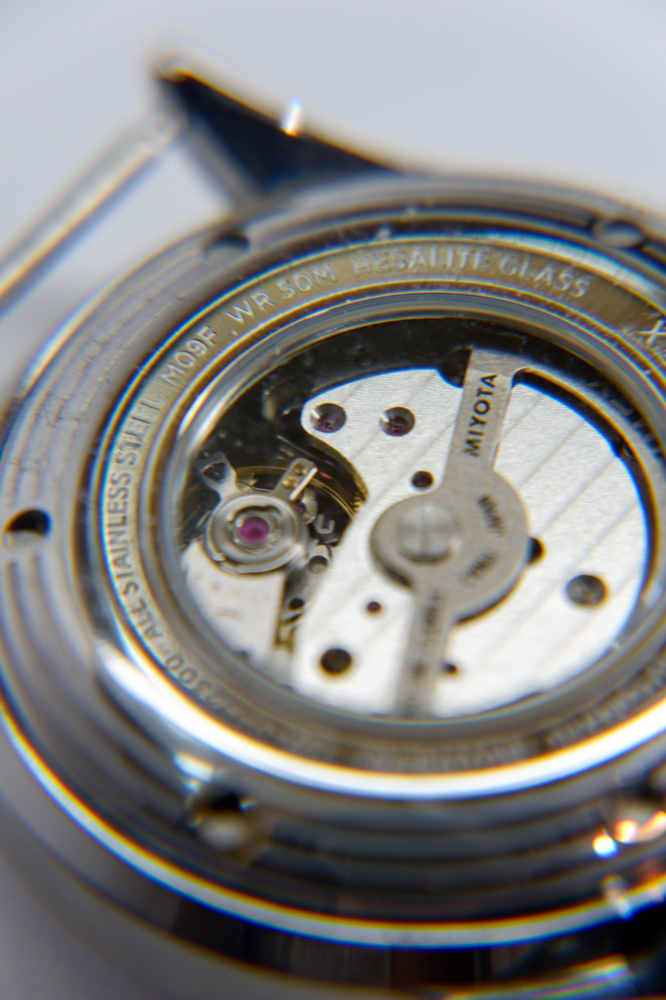

My daily watch of choice is the Timex Marlin Jet Automatic. Despite the jet moniker, the entire model family is a '60s Space Age reimagination of the classic Marlin silhouette. I was introduced to the classic Marlin by a friend and fell in love with the domed crystal. That made me dig through the Timex catalog before settling on this model, where I purchased it second hand (ha) while in the army. It was a tough find in Korea!

i love the bubble

The classic dome exists throughout generations of the Marlin and maintains the iconic bezel-less look when viewed from above. This is the defining design feature. If you don't like this, never get a Marlin. 'Hesalite crystal' just means its acrylic, which is completely justified for the price. The original Marlin (among other vintage classics) used acrylic as well, so it's a vibe.

Fun fact: Coincidentally, hesalite was used in the Omega Moonwatch for cracking instead of shattering on impact, earning NASA's approval. Fits the Space Age theme.

The case tries to be inconspicuous, directing the spotlight to the crystal dome. It is stainless steel with a simple design, smoothly transitioning into straight lugs that try their best to blend into the background.

The bezel under the crystal is engraved with double stripes, broken by the text 'MARLIN' on the six and twelve o'clock positions. I appreciate this detail—its tasteful addition gives the fillet of the crystal more to play with, bending and distorting the lines.

The crown is also simple, though not completely unadorned. Embossed into the crown is a T, presumably for Timex. I dislike this detail. Because the crown is push/pull with no crown guards, it's bound to spin in place from simply wearing the watch. That misaligns the symbol and a part of my brain cannot stand it. It's a non-problem of course, but I'm not sure why it had to be a T.

Enough nitpicking. The face of the watch is beautiful.

